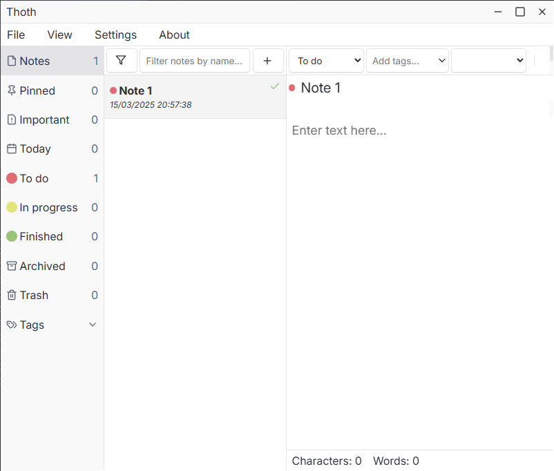

# Note-taking app

# Image of the app

# Information
This app is under development.

# Description
Taking inspiration from note-taking apps like Inkdrop, Bear, Obsidian, Notable, and Evernote, I decided to create my own app.

My goal was to design a tool that was tailored to my needs without having to spend money on existing solutions.
This project also offers me the opportunity to improve my development skills.

It is essential whether it is for my technology watch or for simple note-taking.

# Stack
- Frontend: Vue.js, vue i18n
- Backend & API: Tauri (fs, sql)
- Icons: Lucide
- Markdown: marked + DOMpurify
- Database: SQLite

# Features implemented
- Organize notes
- Dark theme
- Distraction-free mode
- Split editor
- Preview markdown
- Tags
- Export data to json
- Import data from json
- Demo note
- Embedded database
- Debug with log files
- Support different languages

# Features to implement
## File
- Export PDF, file...
- Print

## View
- Add different views (kanban...)

## SEO, websites...
- Create documentation
- Accessibility
